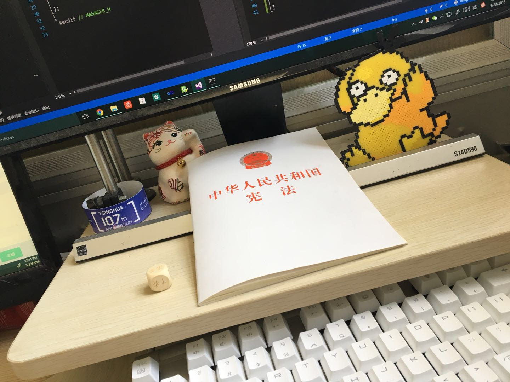
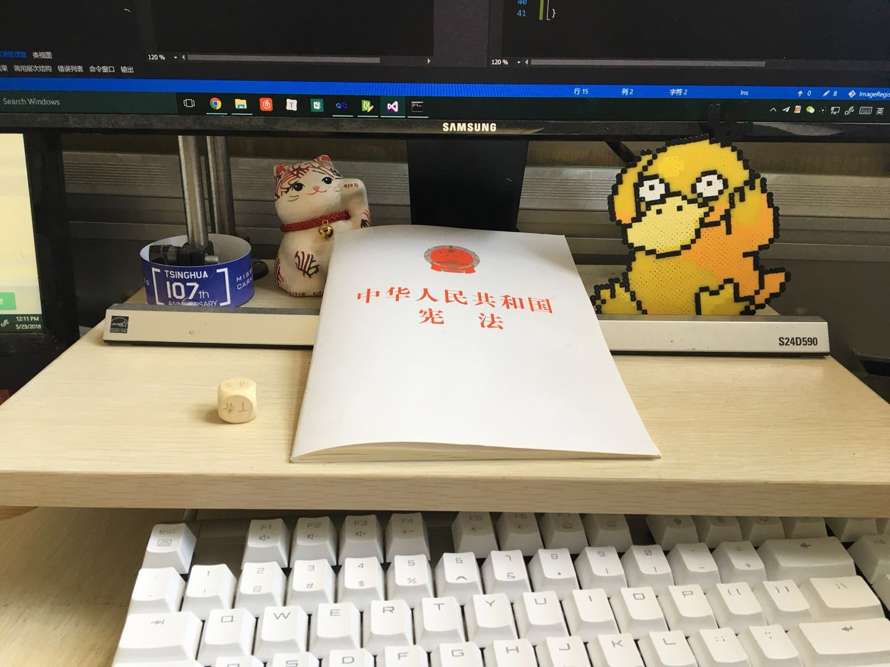
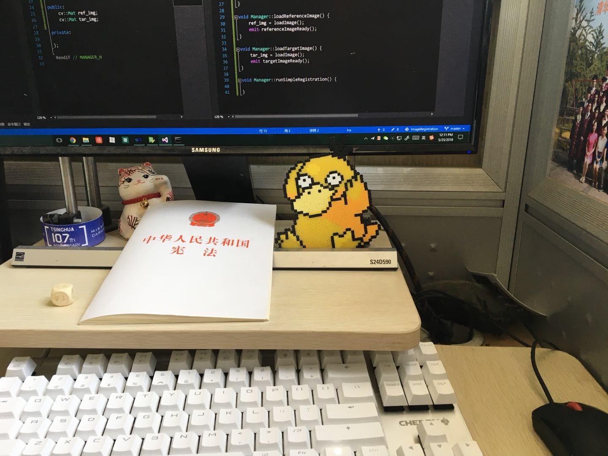
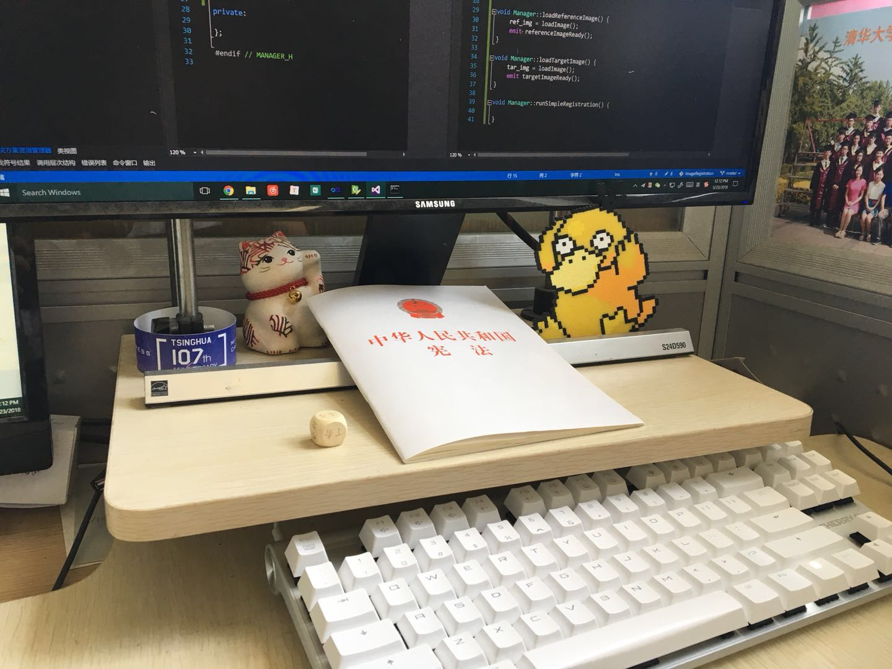
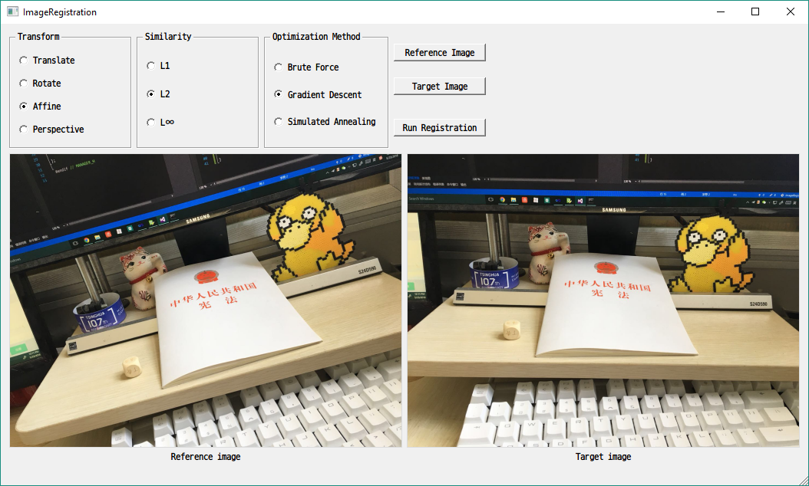
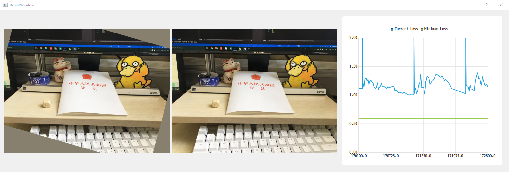
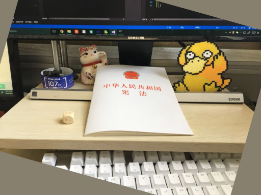
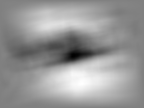
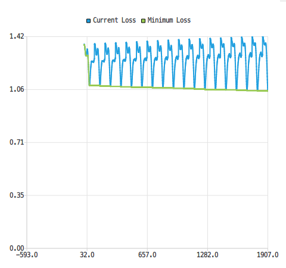
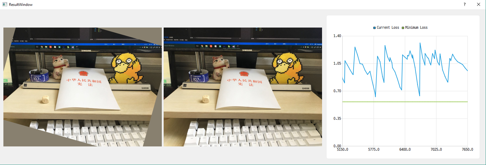

# 现代优化方法实验报告

[TOC]

## 1. 概述

本次实验中，我基于OpenCV，实现了一个二维图像配准工具，全部代码均为自行实现，OpenCV用于计算图像变换与相似度。

该工具能够将一幅图像进行变换，并与另一幅图像相匹配。支持包括平移、旋转(含平移、缩放)、仿射与透视共四种变换，使用L1、L2、无穷范数作为优化的目标函数，实现了暴力算法、梯度下降法、模拟退火算法来求解该优化问题。

## 2. 应用问题

如果两幅图像，它们是在同一场景、不同角度下拍摄的，那么，存在一种图像变换，使得其中一幅图像经过变换后，能与另一图像大部分重合。

上述图像变换被称为配准(registration)$T$，被变换的图像被称为参考图像$I_M$，另一图像被称为目标图像$I_F$。优化的目标是使变换后的参考图像$T(I_M)$与目标图像$I_F$的差异尽可能低。

最简单的图像变换是平移变换，需要确定两个参数: $\Delta x$和$\Delta y$; 旋转变换通常与缩放、平移共同进行，需要确定四个参数: $\Delta x$、$\Delta y$、$\theta$、$scale$; 仿射变换将矩形图像线性映射至一个平行四边形，需要确定三个坐标点，共六个参数，三个坐标点分别表示原图左上、右上、左下角变换至新图像的坐标位置; 透视变换与仿射变换相似，不同的是原图像的四个顶点可变换至任意的四边形，所以需要确定四个坐标点，共八个参数。此外，也有更为精细的图像变换方法，但相比于上述简单变换，其参数较多，难以优化，故本次实验不予考虑。

对于图像相似度，需针对使用场景选择合适的度量方法。本实验中，实现的方法有L1(1范数)、L2(2范数)、无穷范数三种。

总的来说，问题可以总结为如下步骤:

*   输入参考图像、目标图像;
*   选择合适的变换，确定参数范围;
*   设置初始参数，在这个参数下变换参考图像，并计算与目标图像的差异;
*   调整参数，使上述差异达到最小值;
*   输出最优参数作为配准变换。

## 3. 数据来源

本实验使用在实验室拍摄的四张照片作为测试数据。

|  |  |
| --------------- | --------------- |
|  |  |

## 4. 实现算法

### 4.1 软件界面

本实验搭建了一个二维图像配准工具。"主界面"可进行配准的各项设置，并展示参考图像与目标图像:



"结果界面"会在运行配准之后弹出，分左中右三栏，分别为变换后的参考图像、变换后的参考图像与目标图像的对比(会交替显示两图像)、目标函数优化曲线:



### 4.2 优化算法

在上述基础上实现了三种优化算法，分别是暴力算法、梯度下降法、模拟退火算法。执行算法前，首先会在`Registration::initialize()`函数中针对不同变换方式，初始化变换的各项参数，例如旋转变换(四个参数):

```cpp
params.resize(4); // cx cy angle scale
limits.resize(4);
steps.resize(4);
limits[0] = std::make_pair(-c / 2, c / 2);
limits[1] = std::make_pair(-r / 2, r / 2);
limits[2] = std::make_pair(-180, 180);
limits[3] = std::make_pair(0.5, 2);
for (int i = 0; i < params.size(); i++) {
  params[i] = limits[i].first;
}
steps[0] = 1;
steps[1] = 1;
steps[2] = 1;
steps[3] = 0.01;
```

其中`params`表示参数数组，`limits`表示各个参数的取值范围，`steps`表示各个参数邻域的步长。

暴力算法使用深度优先搜索遍历整个可行解空间，可求解出全局的最优解:

```cpp
void Registration::optimizeNaive(int pos) {
    if (pos >= params.size()) {
        completeIteration();
        return;
    }
    for (float i = limits[pos].first; i <= limits[pos].second; i += steps[pos]) {
        params[pos] = i;
        optimizeNaive(pos + 1);
    }
}
```

梯度下降法在每轮迭代中，寻找当前最优解的邻域中最优的可行解，并以此代替最优解，直到邻域中没有比当前解更好的解为止。我实现的函数中，某个可行解的邻域定义为将第$i$个参数增加或减少steps[i]得到的可行解的集合($i$为某个随机参数的序号)。因梯度下降法与初始值选取密切相关，选择不当会导致陷入局部最优解，我在函数中增加了一个外循环，每轮循环随机选择一组初始值，并开始一轮新的梯度下降:

```cpp
void Registration::optimizeGD() {
    for (int i = 0; i < 10000; i++) {
        double tmp_loss = 1e30;
        double cur_loss = 1e30;
        for (int j = 0; j < params.size(); j++) {
            // give random start values
            params[j] = random(limits[j].first, limits[j].second);
        }
        while (true) {
            std::vector<float> old = params;
            std::vector<float> best = params;
            for (int pos = 0; pos < params.size(); pos++) {
                params[pos] = old[pos] + steps[pos];
                optimizeGDHelper(best, cur_loss);
                params[pos] = old[pos] - steps[pos];
                optimizeGDHelper(best, cur_loss);
                params[pos] = old[pos];
            }
            if (tmp_loss == cur_loss) {
                break;
            }
            tmp_loss = cur_loss;
            params = best;
            completeIteration();
        }
        completeIteration();
    }
}
void Registration::optimizeGDHelper(std::vector<float>& best, double& cur_loss) {
    applyTransform();
    double s = getSimilarity(trans_img, tar_img, similarity_type);
    if (s < cur_loss) {
        cur_loss = s;
        best = params;
    }
}
```

模拟退火算法与梯度下降法相比，具有跳出局部最优解的能力。当温度较低时，算法不容易跳出局部最优解，从而退化为梯度下降法。所以，如果在温度下降到很低时没能跳入最优解附近，算法同样会收敛于局部最优解。因此，与上述梯度下降法的代码类似，我也使用了一层外循环，用于生成多个随机初始参数:

```cpp
void Registration::optimizeSA() {
    for (int i = 0; i < 10000; i++) {
        for (int j = 0; j < params.size(); j++) {
            // give random start values
            params[j] = random(limits[j].first, limits[j].second);
        }
        applyTransform();
        double fi = getSimilarity(trans_img, tar_img, similarity_type);
        double temp = 10;
        double r = 0.99;
        int k = 1000;
        while (k > 0) {
            // select a random neighbor
            int len = params.size();
            int r1 = rand() % len;
            double r2 = random(1, 10) * ((rand() % 2) * 2 - 1);
            params[r1] += r2 * steps[r1];
            applyTransform();
            double fj = getSimilarity(trans_img, tar_img, similarity_type);
            double delta = fj - fi;
            if (random(0, 1) < exp(-delta / temp)) {
                // jump to this neighbor
                completeIteration(iter % 10 == 0);
                fi = fj;
            } else {
                params[r1] -= r2 * steps[r1];
            }
            temp *= r;
            k--;
        }
        completeIteration();
    }
}
```

### 4.3 实现细节

1.  计算图像变换、图像相似度需要遍历图像每一像素，这一过程是较为耗时的。对此，代码中将图像先缩小至原有尺寸的$1/10$，即，像素数变为原来的$1/100$，再进行变换、相似度计算。最终再恢复至原有图像尺寸。
2.  图像变换后，其周围可能出现空白区域(下图)，在计算图像相似度时，这一区域也是需要计算的(否则会倾向于生成全是边界的图像)，所以需要填补这一区域。我使用的方法是计算全图像的平均颜色，并以平均颜色填补。
    

### 4.4 完整代码

见本次作业`src`文件夹。

## 5. 实验结果与分析

### 5.1 目标函数值可视化

下图展示了4号图片到1号图片的平移变换的优化目标函数值。平移变换有两个参数，所以可以映射到二维空间。使用上述暴力算法计算出参考图像平移至所有位置，计算其目标函数值，便得到如下的可视化结果。

从图中可以看出目标函数最优值(最小值)位于图像中间附近，有局部最优值，但该函数较为光滑，因此可认为性质较好。



### 5.2 结果

#### 5.2.1 暴力算法

暴力算法效率较低，所以只进行了平移变换、旋转变换的实验。其中，平移变换约耗时3秒，旋转变换耗时数分钟。

该算法可以确保找到最优解，可作为其他算法的验证手段。

下图是枚举平移变换参数时，相似度函数的变化曲线:



#### 5.2.2 梯度下降法

下图是使用梯度下降法优化仿射变换配准问题的结果，在迭代至5000轮左右时，已经找到较好的结果。这里，每一轮迭代指的是找到一个新的最优值，或开启一次新的梯度下降。

右侧的蓝色曲线表示梯度下降过程的目标函数值变化，可以看出，在每轮梯度下降过程内，目标函数值能够快速下降。



#### 5.2.3 模拟退火算法

下图使用了模拟退火算法来计算5.2.2中相同的优化问题以便对比。该方法约在4000轮左右取得一个较好的解，更好的解出现在50000轮左右。

相比于梯度下降法，模拟退火在每轮迭代中不需要计算所有邻域解，而梯度下降计算数量为参数个数$\times 2$，所以模拟退火的迭代速度高于梯度下降。

为了使两次模拟退火之间可以区分，我在两次模拟退火的能量函数之间插入了一个峰值。观察蓝色曲线可以发现，每次运行模拟退火时，前期能量函数波动较大(因为跳到更差的解的几率很大)，在后期逐渐趋于稳定，类似梯度下降的结果。


### 5.3 参数调整

三种算法中，只有模拟退火算法有需要调整的参数。包括迭代次数`k`、初始温度`temp`与温度衰减系数`r`。

`k`控制何时停止迭代，根据曲线取值即可。

起初不知道如何设置初始温度与衰减系数，将温度设置得很高，衰减也很快，然后发现优化效果不如梯度下降法。分析各个参数的作用与模拟退火算法的优势之后，我得到结论: 

*   初始温度应与目标函数值在同一量级;
*   衰减系数应调整到使得温度在进行了一半的迭代轮数之后下降到足够低，进而使得优化只向更优的可行解跳跃。

最终的曲线和期望一致，一开始有较大的波动，随后逐渐稳定直至收敛。

### 5.4 分析与结论

本次实验我得到了如下结论:

1.  经过对比试验，对于二维照片配准问题，使用2范数作为相似性度量函数的效果较好，其次是1范数。
2.  参数空间的邻域结构非常重要。
    例如仿射变换矩阵尺寸为$2\times3$，有六个参数，若直接优化这六个参数，则优化结果较差，很难收敛到最优解。原因可能是这六个参数的现实意义不够明确(例如，增大第一个参数会使图像怎样变化)，且参数之间存在较大关联性(例如，同时增大第一个、第五个参数，作用是放大图像，而只改变一个则图像会变得不自然)。
    仿射变换的另一种表示方式是，原图像的左上、右上、左下三个顶点分别变换到了新图像的哪些位置，同样需要六个参数描述，但这些参数的可解释性更强，目标函数也更容易优化至最优。
    实验发现，选择合适的参数能够让目标函数的性质更好，更容易收敛到全局最优解。
3.  模拟退火算法在图像配准问题上的优势不明显。
    对于特别不光滑的目标函数，梯度下降算法是无能无力的，因为选择一个随机初始值下降至全局最优值的概率非常低。而模拟退火算法有助于跳出这些波动，相比梯度下降法更容易得到最优解。
    但是对于图像配准问题，其目标函数性质较好，局部最优解较少。于是，多次使用梯度下降算法也能够找到全局最优解，模拟退火算法的优势难以体现。